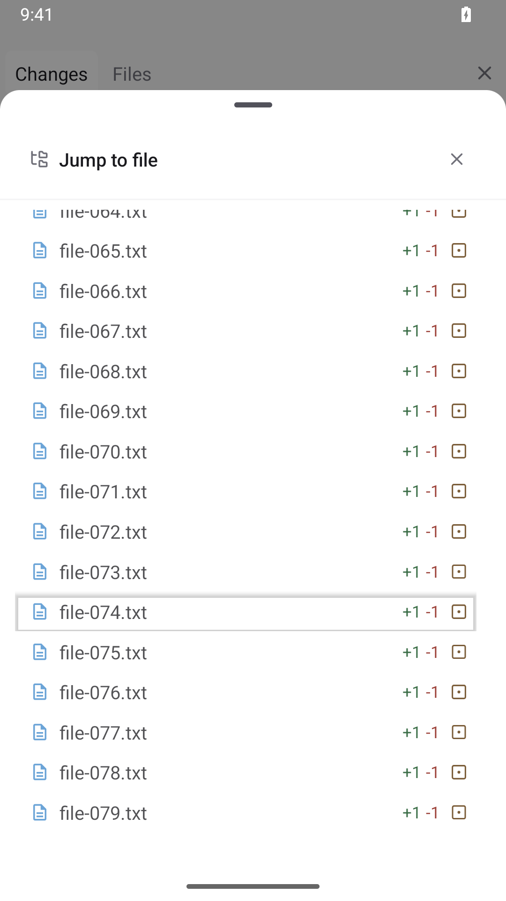
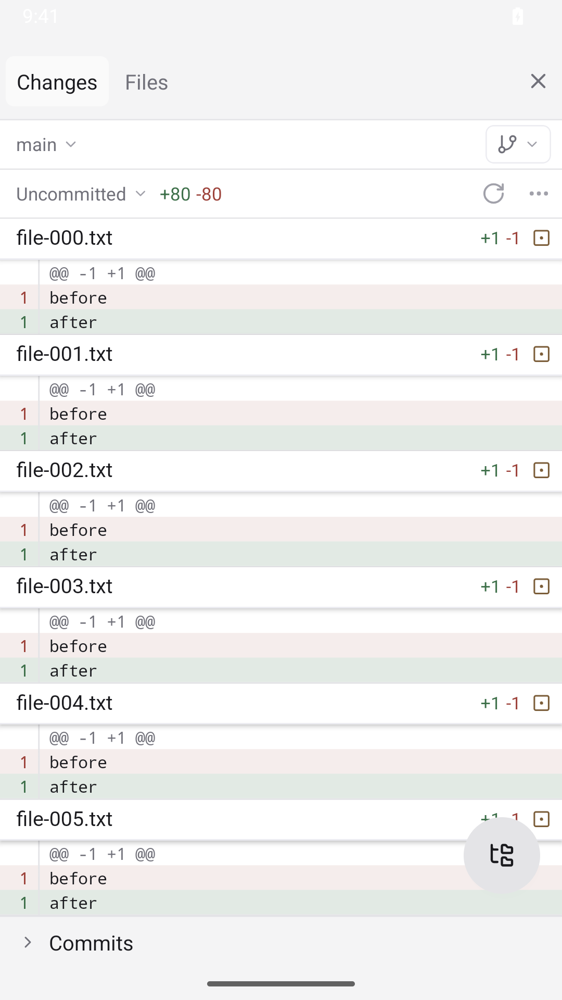
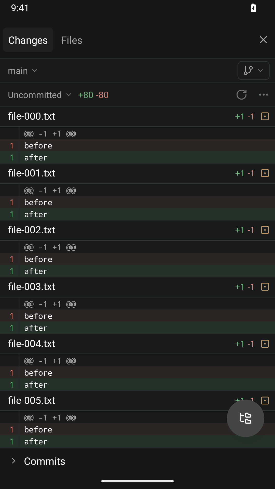

# Mobile diff tree appearance

## Reproduce the row shadow

Use an Android emulator with a workspace containing 80 modified text files,
named `file-000.txt` through `file-079.txt`. Each file changes `before` to `after`.

1. Open the workspace's Changes sidebar, then **Jump to file**.
2. Swipe upward through the tree until `file-079.txt` is visible.
3. Inspect the row where the scroll gesture started. It must remain flat.
4. Swipe back to the first file, then return to the last file and select it.
   The sheet should close and show that file's diff.

## Recorded verification

Android API 35, 1080×1920. The baseline produced a raised gray shadow around
`file-074.txt` after scrolling. The fixed build reached the same last row without
the shadow. Baseline scrolling in both directions and selection of the last file
passed; the fixed build also reached the last row and closed the sheet on selection.
The fixed-build assertion for the selected diff header did not match, so it does
not establish the final jump position.

| Before                             | After                            |
| ---------------------------------- | -------------------------------- |
|  |  |

| Light                             | Dark                            |
| --------------------------------- | ------------------------------- |
|  |  |

The shadow check is visual; the existing header-interaction unit test does not
test Android rendering. iOS, browser web, and Electron were not manually exercised.
