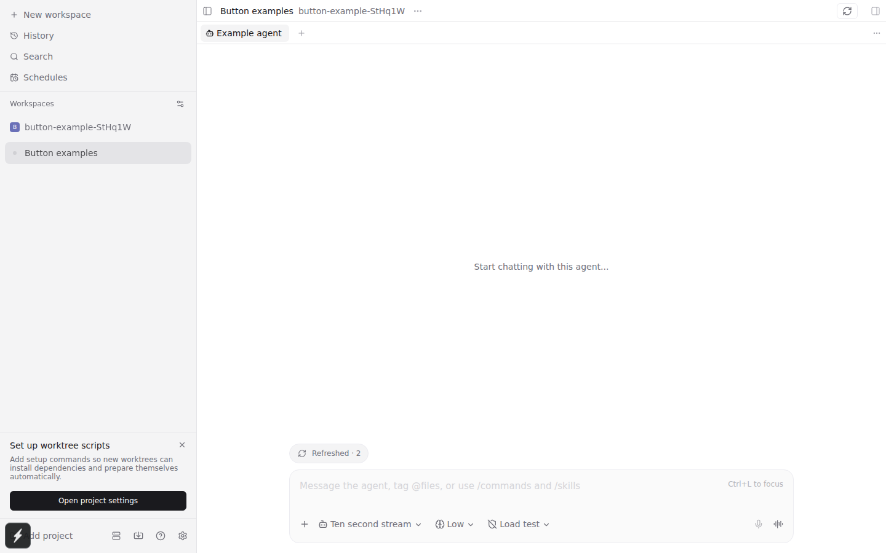
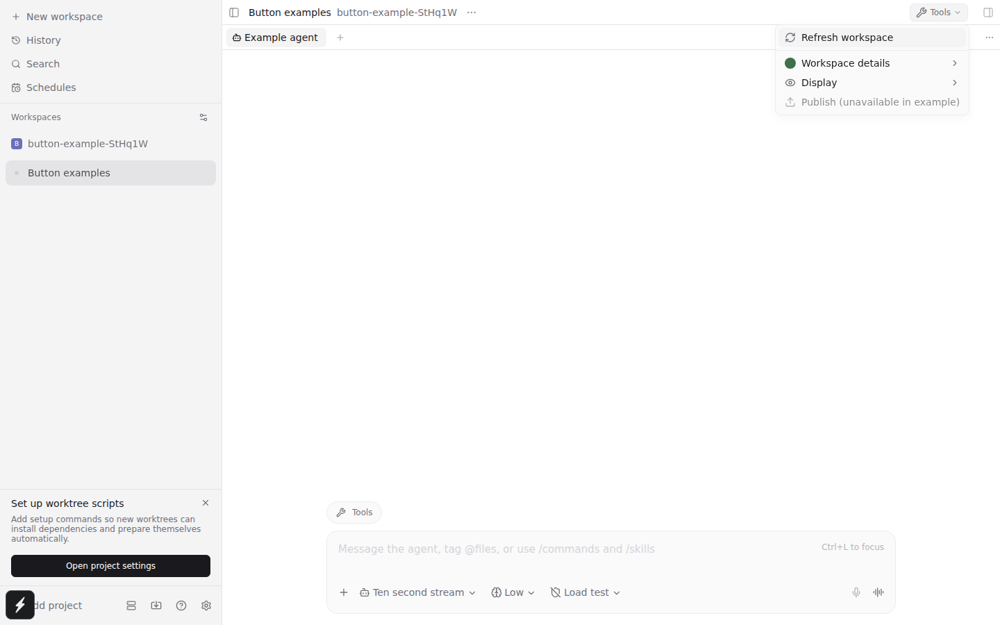
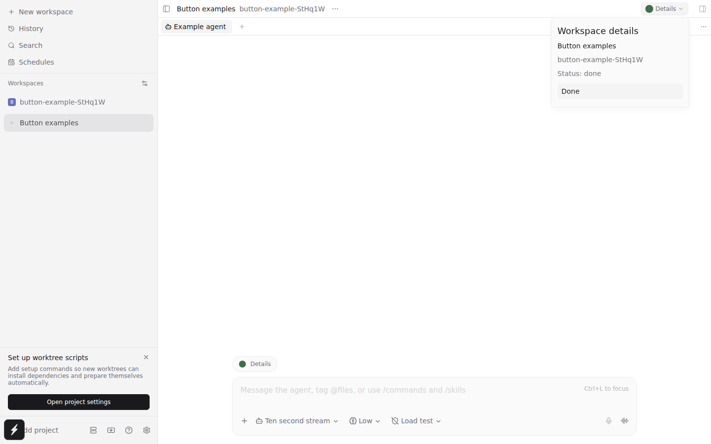
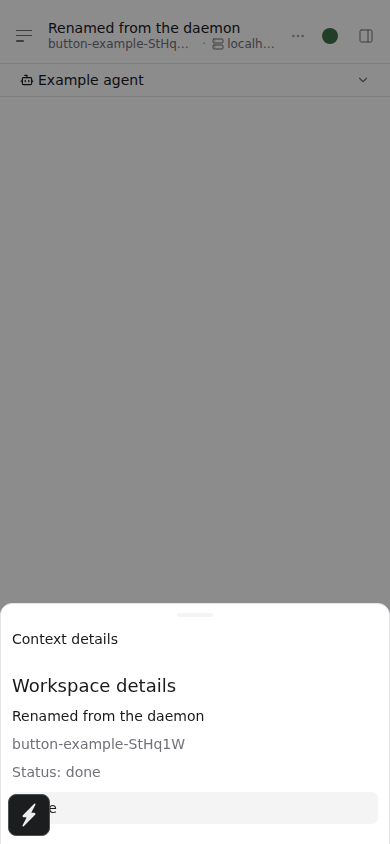

# Header buttons and composer pills

Install this directory as a plugin, open an agent, and choose **Button examples: action** in the
Command Center. One header button and one composer pill appear. Choose another mode to update
those same registrations. Switching agents moves the example to that agent's workspace and composer.

| Command Center command                | Header                                | Composer                        | Try                                                                                                                   |
| ------------------------------------- | ------------------------------------- | ------------------------------- | --------------------------------------------------------------------------------------------------------------------- |
| **Button examples: action**           | Refresh icon only                     | Refresh icon and label          | Refresh reads the workspace from the daemon and updates the label and tooltip. Paseo owns pending and error feedback. |
| **Button examples: menu**             | Wrench, Tools, chevron                | Wrench and Tools                | Refresh, a separator, custom details, a Display submenu, and a disabled item.                                         |
| **Button examples: popover**          | Reactive status dot, Details, chevron | Reactive status dot and Details | Workspace data updates through `useWorkspace`; Done closes the surface.                                               |
| **Button examples: hide / show**      | Hide or restore the button            | Hide or restore the pill        | Visibility changes through `registration.update({ visible })`.                                                        |
| **Button examples: disable / enable** | Disable or enable the button          | Disable or enable the pill      | Disabled state changes through `registration.update({ disabled })`.                                                   |

On compact layouts the header button is borderless and icon-only. Menus and custom content open
bottom sheets. Composer pills keep their icon and label, without a chevron, on every layout.

The example contributes one header button at a time. Additional actions live under the named
**Tools** button; the example does not add a three-dot control or trigger plugin overflow.

| Action                                                        | Menu                                      | Custom content                                             | Compact sheet                                                   |
| ------------------------------------------------------------- | ----------------------------------------- | ---------------------------------------------------------- | --------------------------------------------------------------- |
|  |  |  |  |

The client entry owns the active example. [client/examples.tsx](client/examples.tsx) contains the
descriptors, updates, and React content. Return `.remove()` cleanup when the example moves or stops.
See the [button reference](../../public-docs/plugins/v0.8/reference.md#button-descriptor) and
[composer migration](../../public-docs/plugins/v0.8/migration.md#composer-pills).

From the repository root, `npm run typecheck --workspace=@getpaseo/plugin` checks this example
against the SDK. Existing plugin projects must update `@getpaseo/plugin` before running their own
`npm run typecheck` to detect the old `Component`/`onPress` pill shape and callable cleanup handle.

The browser regression installs this exact directory in an isolated daemon and exercises both
layouts, updates, and cleanup:

```sh
npm run test:e2e --workspace=@getpaseo/app -- e2e/browser/plugin-button-example.spec.ts
```

The captures use Chromium at desktop and phone widths; native iOS and Android were not exercised.
