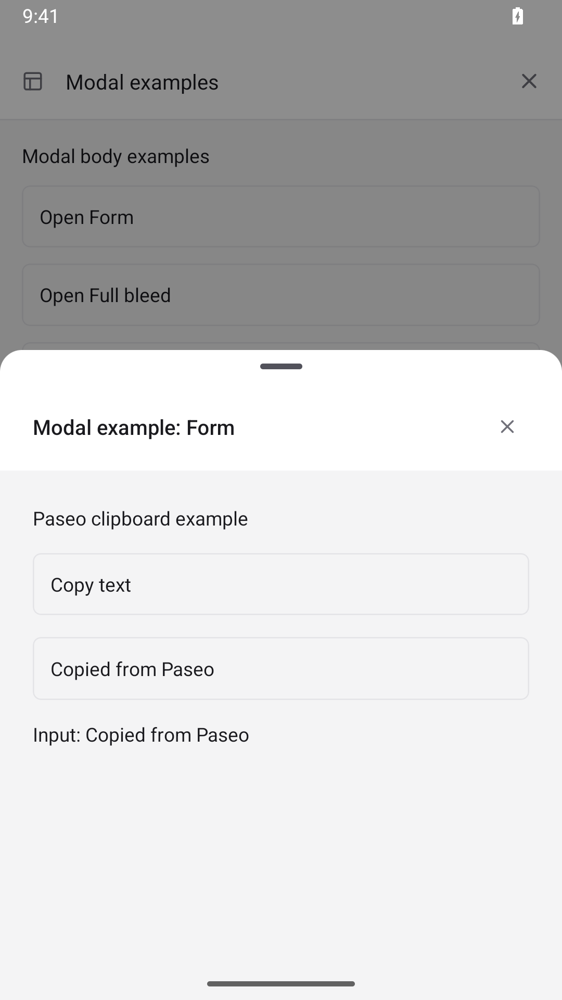
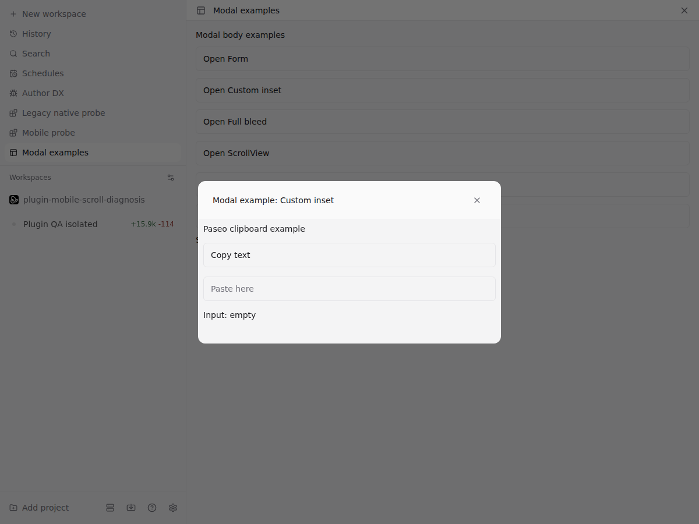
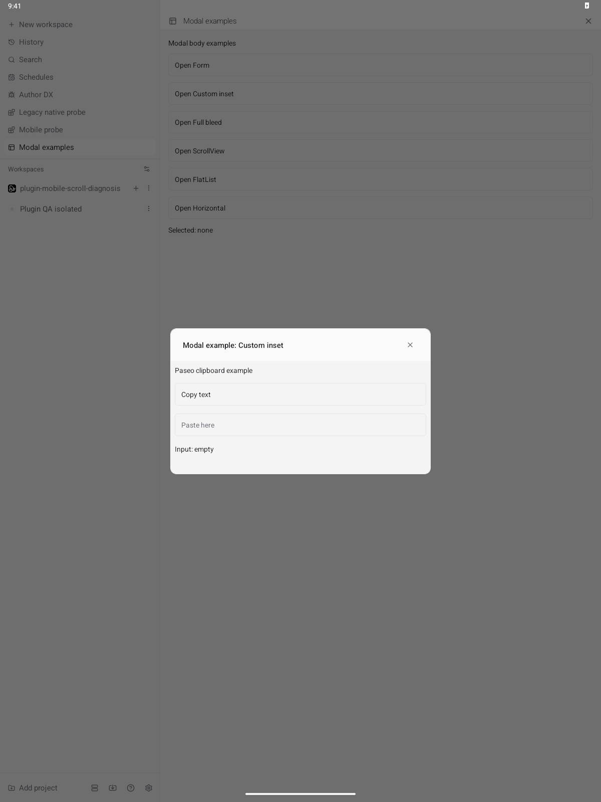

# Modal UI example

Install this directory as a local plugin, then open **Modal examples** from the sidebar or a workspace tab.

The examples demonstrate default and custom padding, a full-width body, author-owned ScrollView and
FlatList scrolling, horizontal tabs, and clipboard actions with a keyboard-aware input. See the
[host UI reference](../../public-docs/plugins/v0.8/reference.md#host-ui) for the API contract.

The browser regression installs this exact example in an isolated daemon:

```sh
cd packages/app
npx playwright test e2e/browser/plugin-modal-body.spec.ts --project=browser --workers=1
```

On Android, open each example and drag up on its content to expand the sheet, then scroll the list.
In FlatList, expand before using **Jump to last row**; row 100 should be visible. At the top of either
list, drag down on a row to dismiss the sheet. In Form,
press **Copy text**, long-press the input, and choose **Paste**. The input should contain
“Copied from Paseo”. With the system keyboard enabled, focusing the input should keep it visible.

Run the [native sheet regression](../../packages/app/e2e/mobile/modal-sheet/README.md) to check body
dismissal, list scrolling and horizontal tabs together.

These captures show Android copy/paste and custom padding on browser and wide native layouts.
Android API 35 and Chromium were exercised; iOS and Electron were not tested.

| Android copy/paste                                               | Browser custom padding                                      | Wide Android custom padding                                               |
| ---------------------------------------------------------------- | ----------------------------------------------------------- | ------------------------------------------------------------------------- |
|  |  |  |
